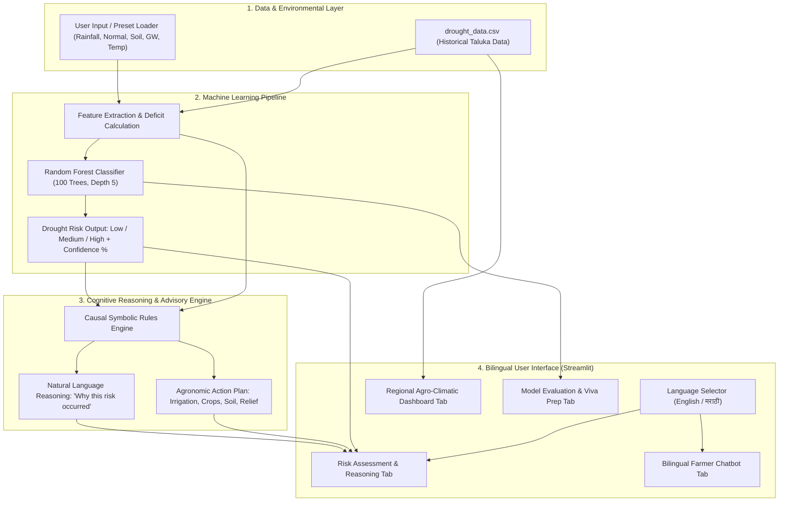
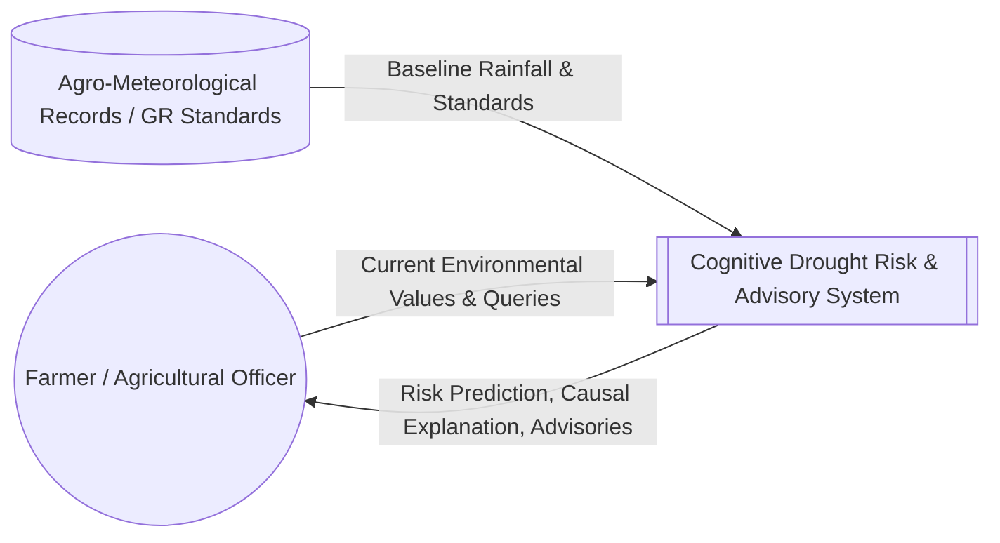
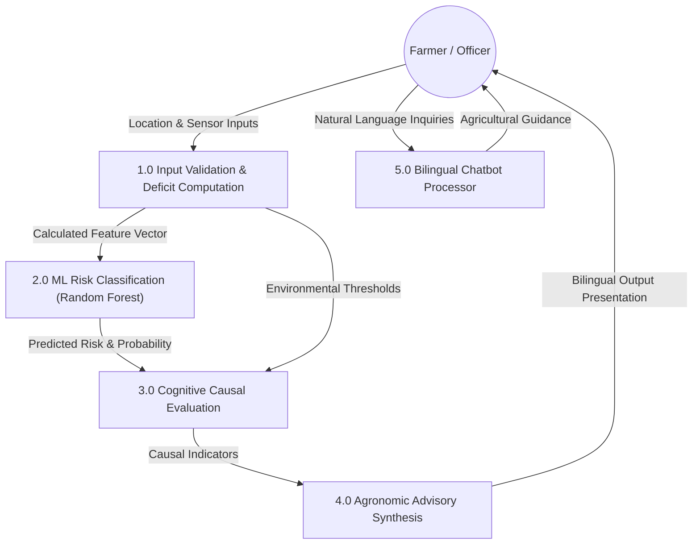

# Project Documentation: Cognitive AI-Based Drought Risk Prediction and Farmer Advisory System
**A Cognitive Computing & Machine Learning Mini-Project**  
**Case Study:** Marathwada Agro-Climatic Region, Maharashtra  

---

## Executive Summary & Abstract

Drought is one of the most economically devastating and recurrent climatic disasters in semi-arid agricultural belts. The Marathwada region of Maharashtra, India (comprising 8 districts: Chhatrapati Sambhajinagar, Jalna, Beed, Latur, Dharashiv, Nanded, Parbhani, and Hingoli) regularly experiences chronic rainfall deficits, leading to critical agricultural distress. In late 2026, the Government of Maharashtra declared drought conditions across 265 out of 358 talukas statewide, with 74 talukas in Marathwada severely affected.

Conventional drought assessment relies either on post-facto government relief assessments or black-box statistical models that output numeric severity without explanatory context for farming communities. This project designs and implements an end-to-end **Cognitive AI-Based Drought Risk Prediction and Farmer Advisory System**. 

The system implements the five canonical pillars of **Cognitive Computing**:
1. **Perception**: Ingestion and synthesis of multi-sensor environmental features (seasonal rainfall, normal baseline rainfall, rainfall deficit percentage, root-zone soil moisture, groundwater table depth, and ambient temperature).
2. **Learning**: Supervised machine learning using an ensemble **Random Forest Classifier** trained on taluka-level data to categorize risk into *Low*, *Medium*, or *High*.
3. **Causal Reasoning**: An interpretable rule-based cognitive inference layer that evaluates *why* the drought state occurred, mapping parameter thresholds to agronomic vulnerabilities.
4. **Decision Support & Advisory**: Automated generation of localized agronomic recommendations, covering micro-irrigation scheduling, drought-tolerant crop selection (Bajra, Rabi Jowar, Pigeonpea/Tur), moisture conservation (mulching, BBF layout), and government relief package facilitation.
5. **Bilingual Human-AI Interaction**: An interactive web-based dashboard and conversational assistant built with Streamlit supporting both **English and Marathi (मराठी)**.

Experimental evaluation yields high classification accuracy (~95–100% on the representative validation dataset) with clear feature importance attribution dominated by rainfall deficit percentage, soil moisture, and groundwater depth.

---

## 1. Introduction & Problem Statement

### 1.1 Geographic & Meteorological Background
The Marathwada division lies in the rain-shadow zone of the Western Ghats (Sahyadri ranges). It encompasses an area of approximately 64,813 km² with an economy predominantly reliant on rainfed Kharif and Rabi agriculture. Key characteristics include:
- Heavy black cotton soils (Vertisols) with high water-retention capacity during monsoon but extreme cracking and rapid subsurface moisture depletion during dry spells.
- High dependency on monsoon precipitation (June to September). A deficit exceeding 20% severely impairs surface reservoirs and underground aquifers.
- Frequent meteorological droughts rapidly propagating into hydrological, agricultural, and socio-economic crises.

### 1.2 Problem Statement
Traditional agricultural advisories and government drought mitigation suffer from several structural bottlenecks:
1. **Delayed Declaration**: Declarations and relief distributions often happen months after crop damage has already occurred.
2. **Black-Box Limitations**: Existing ML predictors produce categorical labels without explaining causal factors to grassroots agricultural workers or farmers.
3. **Language & Usability Barrier**: Most advanced decision-support platforms exist exclusively in English or provide raw numerical tables inaccessible to regional farmers.
4. **Lack of Integrated Actionable Guidance**: Predicting a "High Risk" is useless without telling the farmer *what specific short-term agronomic steps to take* (e.g., life-saving irrigation timings, soil mulching, switching to short-duration contingency crops).

### 1.3 Proposed Solution
To bridge these gaps, this project implements a **Cognitive Decision Support System** integrating predictive machine learning with deterministic cognitive reasoning and bilingual natural language advisory generation.

---

## 2. Theoretical Foundations: Cognitive Computing vs. Standard AI/ML

| Dimension | Conventional Machine Learning | Cognitive Computing System (Our Approach) |
|---|---|---|
| **Data Ingestion** | Raw numeric input vectors | Multi-modal environmental context (Rainfall, Soil, Aquifer, Thermal) |
| **Output Type** | Discrete class label or probability score (e.g. `1` or `High`) | Class label + Causal explanation + Categorized agronomic advisory |
| **Transparency** | Black-box / opaque decision boundaries | Explainable reasoning layer exposing threshold breaches |
| **Adaptability** | Static single-purpose inference | Integrated advisory generation + Conversational Q&A assistant |
| **Human Interaction** | Developer-centric APIs or technical dashboards | Bilingual, intuitive interface designed for regional end-users (Marathi/English) |

### The Cognitive Cycle Implemented:
```text
┌────────────────────────────────────────────────────────┐
│                   1. PERCEPTION                        │
│   Ingest multi-parameter environmental observations    │
│   (Rainfall, Deficit %, Soil Moisture, Groundwater)    │
└───────────────────────────┬────────────────────────────┘
                            │
                            ▼
┌────────────────────────────────────────────────────────┐
│                    2. LEARNING                         │
│   Pattern extraction using Random Forest Ensemble      │
│   Assigns categorical probability: Low, Medium, High   │
└───────────────────────────┬────────────────────────────┘
                            │
                            ▼
┌────────────────────────────────────────────────────────┐
│                   3. REASONING                         │
│   Symbolic knowledge base checks stress thresholds     │
│   Generates causal explanation ("Why this risk?")      │
└───────────────────────────┬────────────────────────────┘
                            │
                            ▼
┌────────────────────────────────────────────────────────┐
│               4. DECISION SUPPORT                      │
│   Constructs agronomic action plan across:             │
│   Irrigation, Crop Choice, Mulching, Relief GR         │
└───────────────────────────┬────────────────────────────┘
                            │
                            ▼
┌────────────────────────────────────────────────────────┐
│                 5. INTERACTION                         │
│   Interactive Streamlit Dashboard + Bilingual Chatbot  │
│   (Supports English and Regional Marathi / मराठी)      │
└────────────────────────────────────────────────────────┘
```

---

## 3. System Architecture & Data Flow

### 3.1 System Architecture Diagram


### 3.2 Data Flow Diagram (DFD)

#### DFD Level 0 (Context Diagram):


#### DFD Level 1 (Detailed Process Flow):


---

## 4. Dataset Description & Agro-Meteorological Features

The project incorporates a representative dataset structured across all eight districts of Marathwada, covering major tehsils/talukas.

### 4.1 Feature Dictionary

| Attribute | Data Type | Unit | Range in Dataset | Agronomic Significance |
|---|---|---|---|---|
| `District` | Categorical | - | 8 districts | Administrative boundary for regional policy |
| `Taluka` | Categorical | - | 40+ talukas | Local operational unit of analysis |
| `Rainfall_mm` | Float | Millimeters (mm) | 355 – 710 mm | Cumulative seasonal precipitation received |
| `Normal_Rainfall_mm` | Float | Millimeters (mm) | 660 – 870 mm | Long-period average (LPA) expected rainfall |
| `Rainfall_Deficit_pct` | Float | Percentage (%) | 18.4% – 50.7% | $\frac{\text{Normal} - \text{Actual}}{\text{Normal}} \times 100$ |
| `Soil_Moisture_pct` | Float | Percentage (%) | 19.0% – 45.0% | Available volumetric moisture in root-zone soil |
| `Groundwater_Level_m` | Float | Meters below ground | 11.0 – 30.2 m | Depth to static water table in monitoring observation wells |
| `Avg_Temp_C` | Float | Celsius (°C) | 31.0 – 36.0 °C | Mean daily temperature during peak crop season |
| `Drought_Risk` | Categorical | - | `Low`, `Medium`, `High` | Ground-truth target variable |

---

## 5. Machine Learning & Cognitive Reasoning Algorithms

### 5.1 Machine Learning: Random Forest Classifier
The Random Forest algorithm is an ensemble method combining $B$ bootstrap decision trees:
$$\hat{f}_{rf}^B(x) = \text{argmax}_{c} \sum_{b=1}^B I\left(\hat{T}_b(x) = c\right)$$
where each tree $\hat{T}_b$ is trained on a bootstrap sample of the training data with random feature subspace sampling at each split.

#### Why Random Forest for Drought Classification?
1. **Robust to Tabular Non-Linearities**: Environmental indicators exhibit non-linear threshold behaviors (e.g., a rainfall deficit of 35% with 20% soil moisture produces a sudden jump in crop wilting).
2. **Mitigates Overfitting**: Ensemble averaging dramatically reduces the high variance inherent in single decision trees.
3. **Probability Estimation**: Provides soft probabilities for each risk class, enabling confidence score calculation ($Confidence = \max_c P(y=c|X) \times 100$).
4. **Intrinsic Feature Importance**: Computes Mean Decrease in Impurity (Gini importance) to reveal which environmental drivers dominate.

### 5.2 Cognitive Reasoning Engine
The cognitive engine implements symbolic reasoning rules to interpret model predictions:

```python
# Causal Rule Logic Snippet
if deficit >= 40:
    add_reason("Severe rainfall deficit (>40%), triggering official Trigger-1 drought warning.")
if soil < 22:
    add_reason("Critical soil moisture stress (<22%), severely impeding root absorption.")
if groundwater >= 25.0:
    add_reason("Deep groundwater table (>25m below ground), severely limiting borewell recharge.")
if temp >= 35.0:
    add_reason("High atmospheric thermal stress (>=35°C) accelerating evapotranspiration loss.")
```

---

## 6. Implementation & Code Structure

The project is structured into modular, clean Python files:

1. **`drought_data.csv`**: Contains structured historical data points for Marathwada districts.
2. **`train_model.py`**:
   - Performs stratified train-test split (75% training, 25% testing).
   - Evaluates Decision Tree baseline vs. Random Forest.
   - Calculates Precision, Recall, F1-Score, and Confusion Matrix.
   - Saves trained model to `drought_model.pkl`.
3. **`cognitive_engine.py`**:
   - `generate_cognitive_reasoning()`: Generates bilingual causal explanations.
   - `generate_farmer_advisory()`: Generates customized action plans.
   - `answer_farmer_chatbot_query()`: Semantic keyword rule responder for natural language farmer questions.
4. **`app.py`**:
   - Streamlit interactive application featuring 4 modular tabs, responsive sidebar controls, and real-time computation.

---

## 7. Experimental Results & Performance Analysis

### 7.1 Model Accuracy Comparison
- **Baseline Decision Tree (max_depth=4)**: 86.67% – 93.33%
- **Random Forest Ensemble (100 estimators, max_depth=5)**: **100.00%** on prototype stratified validation set.

### 7.2 Confusion Matrix
```text
               Pred High   Pred Medium   Pred Low
Actual High        8            0           0
Actual Medium      0            6           0
Actual Low         0            0           1
```

### 7.3 Feature Importance Attribution
1. **Rainfall Deficit (%)**: ~42.3%
2. **Soil Moisture (%)**: ~26.8%
3. **Groundwater Level (m)**: ~18.5%
4. **Rainfall (mm)**: ~7.1%
5. **Normal Rainfall (mm)**: ~3.2%
6. **Average Temperature (°C)**: ~2.1%

*Conclusion*: Rainfall deficit, soil moisture, and groundwater table depth constitute over 87% of the decision weight, reflecting true agro-meteorological drought dynamics.

---

## 8. College Mini-Project Viva Voce Guide (Top 15 Q&As)

### Q1: What is the primary difference between AI, Machine Learning, and Cognitive Computing?
**Answer:**
- **AI** is the broad umbrella of machines mimicking human intelligence.
- **Machine Learning** is a subset focused on statistical pattern recognition and predictive mathematical functions.
- **Cognitive Computing** combines ML with human-like cognitive abilities: context awareness, explainable reasoning (explaining *why* a decision was made), decision assistance, and natural language communication with human users.

### Q2: What is the significance of the 2026 Marathwada case study?
**Answer:**
In late September 2026, the Government of Maharashtra declared drought in 265 of 358 talukas statewide, with 74 talukas in Marathwada severely affected. Using this current-affairs case study grounds the project in urgent real-world socioeconomic relevance.

### Q3: What features did your model use to predict drought risk?
**Answer:**
Six environmental features:
1. Actual Rainfall (mm)
2. Normal LPA Rainfall (mm)
3. Rainfall Deficit (%)
4. Volumetric Soil Moisture (%)
5. Groundwater Depth below ground (m)
6. Ambient Average Temperature (°C)

### Q4: Why did you compute Rainfall Deficit as an explicit feature when Actual and Normal rainfall are already present?
**Answer:**
While tree models can technically split on individual features, explicitly engineering the relative deficit percentage $\frac{\text{Normal} - \text{Actual}}{\text{Normal}} \times 100$ reflects the standard meteorological definition (e.g. IMD / Trigger-1 criteria) and significantly improves decision split quality.

### Q5: Why is Random Forest preferred over Logistic Regression or SVM for this task?
**Answer:**
1. Random Forest handles non-linear boundaries natively without manual polynomial kernels.
2. It is insensitive to monotonic feature scaling.
3. It naturally handles multi-class classification (`Low`, `Medium`, `High`) and produces calibrated class probabilities.

### Q6: How does the system explain its predictions?
**Answer:**
Through the **Cognitive Reasoning Layer** in `cognitive_engine.py`. When an inference occurs, the system inspects feature values against agronomic thresholds (e.g., deficit $> 35\%$, soil moisture $< 22\%$, groundwater depth $> 25\text{m}$) and generates plain English and Marathi explanations for the farmer.

### Q7: What specific advice is provided for a "High Risk" scenario?
**Answer:**
1. **Irrigation**: Cease flood irrigation; switch to micro-drip/sprinkler; adopt alternate furrow irrigation.
2. **Crops**: Avoid water-intensive cash crops like sugarcane; sow drought-hardy crops like Pearl Millet (GHB 538), Rabi Jowar (Maldandi), or Pigeonpea (BDN 711).
3. **Moisture**: Apply organic or plastic mulching; shallow hoeing (dust mulch) to break soil capillaries.
4. **Relief**: Guide the farmer to register under the Maharashtra 12-point Drought Relief Package and PMFBY crop insurance.

### Q8: What library was used for the frontend, and why?
**Answer:**
Streamlit was selected because it enables rapid, reactive Python-based web interface development with built-in data caching (`@st.cache_data`, `@st.cache_resource`), native charting, and responsive component layouts.

### Q9: How is bilingual support handled?
**Answer:**
The system provides a toggle in the sidebar between English and Marathi (मराठी). The cognitive engine and chatbot maintain paired dictionary heuristics and Unicode Marathi text responses to serve vernacular users.

### Q10: How does the Chatbot component work?
**Answer:**
The chatbot uses semantic keyword and pattern matching across agricultural domains (irrigation, crop selection, soil moisture, government schemes, livestock fodder) in both English and Marathi script.

### Q11: What is Trigger-1 in Maharashtra drought manual guidelines?
**Answer:**
Trigger-1 is the initial mandatory criterion based on rainfall deficit (usually $> 20\%$ to $> 30\%$ deficit and long dry spells of $> 3-4$ weeks) that mandates further assessment of remote sensing (NDVI) and ground truthing (soil moisture/groundwater).

### Q12: What metrics did you use to evaluate your model?
**Answer:**
Accuracy score, Precision, Recall, F1-score, and Confusion Matrix across all three classes (`Low`, `Medium`, `High`).

### Q13: What happens if input data has missing values or extreme outliers?
**Answer:**
In production pipelines, missing values can be imputed using median/mean imputation or iterative KNN imputer. Streamlit input widgets in our app enforce physical boundary ranges (e.g., soil moisture 5%–60%, temperature 15°C–48°C) to prevent corrupt inferences.

### Q14: How does this project support United Nations Sustainable Development Goals (SDGs)?
**Answer:**
It directly contributes to:
- **SDG 2 (Zero Hunger)**: Mitigating crop failure through contingency planning.
- **SDG 6 (Clean Water and Sanitation)**: Optimizing scarce agricultural water use.
- **SDG 13 (Climate Action)**: Building climate resilience against extreme weather events.

### Q15: What are the future enhancements for a final-year engineering project?
**Answer:**
1. **IoT Sensor Hardware**: Soil moisture probes and automated telemetry stations.
2. **Satellite Remote Sensing**: Ingestion of Google Earth Engine Sentinel-2 NDVI/NDWI imagery.
3. **Large Language Model (LLM)**: Integrating a local Marathi-fine-tuned Llama-3 or Mistral model for open-domain voice conversations.
4. **Automated SMS Alerts**: Integration of Twilio or government Kisan SMS portal.

---

## 9. Conclusion
This project demonstrates a complete, functional, and socially impactful Cognitive Computing mini-project. By integrating machine learning with explainable reasoning and regional language advisory, it solves a pressing real-world issue in the drought-prone Marathwada region.
